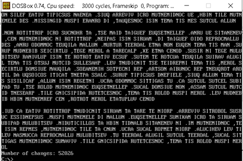

# Programming in assembly language  
Program allows users to use the arguments specified on the command line interface when executing program. 
If the '-h ’switch is specified, the program must display information about itself and about its use.
Use a macro with a parameter, as well as appropriate OS (BIOS) calls for setting the course, printing the string, clearing the console, working with files, etc. Macro definitions must be in a separate file. 
The program must correctly process files with a length of at least 64 kB. When reading, use a field of a suitable size (buffer), while the entire size of the field will always be pushed from the file into the format repeatedly (except for the last reading).
The program must contain appropriate technical documentation.

Task: Print all lines of input while all lowercase letters are exchanged for uppercase letters and print number of exchanges.

Further criteria:
* Source code commentaries and technical documentation written in English.
* If the '-r ’switch is specified, the program lists output in reverse order.
* If the '-p ’switch is specified, the output will be paged, so after filling the screen, the program waits for the keyboard to be pressed.
* Reverse pagging.
* Input files larger than 64 kB are processed correctly. 
* Print name of a file when pagging.
* The assigned task will be implemented as an external procedure (compiled separately and linked to the final program).
 

## Usage  
Program works correctly in DOSBox 0.74 with Borland Turbo Assembler, which produces 16-bit/32-bit output and with linker TLINK. Debugging was done with TD.

To run the program from the command line, you must enter the following command:

```bash
    main.exe <arguments>
```
As argument can be used:
* -h – the program displays information about itself and about its use
* -r – the program lists output in reverse order.
* -p – the output will be paged, so after filling the screen, the program waits for the keyboard to be pressed.
* -rp – reverse pagging

## Documentation  
This chapter focuses on describing the final solution as well as program outputs and inputs.  
### Task (10 points)
Print all lines of input while all lowercase letters are exchanged for uppercase letters and print number of exchanges.

Program output:  
<p align="center">
	
</p>

### Switch ‘-h’ 
When switch ‘-h’ is given as an argument, program displays info about itself. Program provides protection against undefined behaviour, e.g., switch ‘-h’ is correct, but not ‘-hh’. 

Program output if switch ‘-h’ is entered:  
Program output:  
<p align="center">
	
</p>

### Task
Switch ‘–p’ (1 point) + •	(1 point) Print name of a file when pagging
If the ‘-p ’switch is specified, the output is paged, so after filling the screen, the program waits for the keyboard to be pressed:
<p align="center">
	
</p>

### Switch ‘-r’
If the ‘-r ’switch is specified, the program lists output in reverse order:
<p align="center">
	
</p>

### Switch ‘-rp’
If the ‘-rp ’switch is specified, the output will be paged in reverse order:  
<p align="center">
	
</p>

### Input files larger than 64 kB
Input files larger than 64 kB are read byte by byte, while file pointer is being moved:  
<p align="center">
	
</p>

### External procedure
The assigned task is implemented as an external procedure in `task03.asm` file, which is compiled separately and linked to the final program by following command in DOSBox:
```bash
    tasm main.asm
    tasm task03.asm
    tlink main.obj + task03.asm
```  

## Summary
During the elaboration of the assignment, I came across several limitations, among the mentioned limitations is loading the file from arguments or displaying the absolute path to the file.  

Task: Print all lines of input while all lowercase letters are exchanged for uppercase letters and print number of exchanges.

Further criteria:
* Source code commentaries and technical documentation written in English.
* If the '-r ’switch is specified, the program lists output in reverse order.
* If the '-p ’switch is specified, the output will be paged, so after filling the screen, the program waits for the keyboard to be pressed.
* Reverse pagging.
* Input files larger than 64 kB are processed correctly. 
* Print name of a file when pagging.
* The assigned task will be implemented as an external procedure (compiled separately and linked to the final program).


